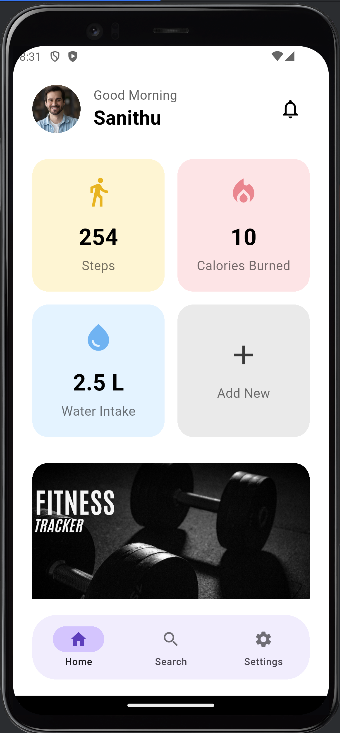
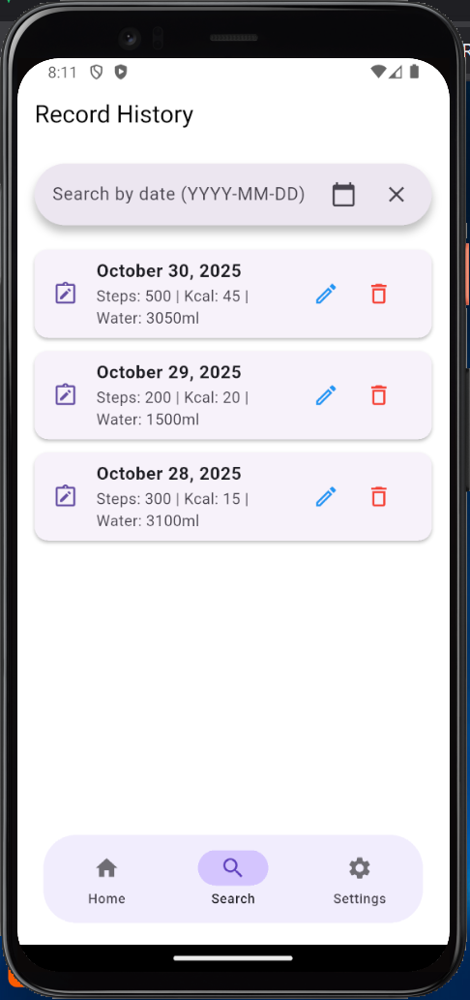

# HealthMate - Fitness Tracker App


A mobile fitness and health tracking application built with Flutter. This app allows users to create an account, log in, and monitor their daily activity, including steps, calories burned, and water intake. All user and health data is stored locally on the device using an `sqflite` database.

This project is currently in development as part of a university assignment, focusing on local database management and feature-based architecture.

## 📱 Screenshots

*Screenshots will be updated as development progresses.*

| Welcome Screen | Home Page | Record History |
| :---: | :---: | :---: |
|  |  |  |


## ✨ Features

- **User Authentication:** Full login and registration system with hashed passwords.
- **Profile Management:** Users can edit their username and profile picture.
- **Daily Tracking:** Log steps, calories, and water intake for each day.
- **One Record Per Day:** Automatically opens today's record to **update** if it exists, or creates a **new** one if it doesn't.
- **Local Database:** All user and health data is stored locally using `sqflite`.
- **Full CRUD Operations:** Complete functionality to Create, Read, Update, and Delete health records.
- **Record History:** A "Record History" page to view, edit, or delete all past entries.
- **Search:** Filter the record history by date.
- **State Management:** Uses the **Provider** package to manage user authentication state across the app.

## 🛠️ Tech Stack

- **Framework:** [Flutter](https://flutter.dev/)
- **Language:** [Dart](https://dart.dev/)
- **State Management:** [Provider](https://pub.dev/packages/provider)
- **Local Database:** [sqflite](https://pub.dev/packages/sqflite)
- **Image Picking:** [image_picker](https://pub.dev/packages/image_picker)
- **File System:** [path_provider](https://pub.dev/packages/path_provider) & [path](https://pub.dev/packages/path)
- **Cryptography:** [crypto](https://pub.dev/packages/crypto) (for SHA-256 password hashing)
- **Date Formatting:** [intl](https://pub.dev/packages/intl)

## 📁 Project Structure

This project follows a feature-based folder structure to keep the code organized and scalable.

```
lib/
├── core/
│   ├── database/
│   │   └── db_connection.dart
│   └── providers/
│       └── user_provider.dart
├── features/
│   ├── auth/
│   │   └── screens/
│   │       ├── login_page.dart
│   │       └── register_page.dart
│   └── home/
│       └── screens/
│           └── home_page.dart
└── main.dart
```


## 🚀 Getting Started

To get a local copy up and running, follow these simple steps.

### Prerequisites

You must have the [Flutter SDK](https://flutter.dev/docs/get-started/install) installed on your machine.

### Installation

1.  **Clone the repository:**
    ```bash
    git clone [https://github.com/YOUR_USERNAME/YOUR_REPOSITORY.git](https://github.com/YOUR_USERNAME/YOUR_REPOSITORY.git)
    ```
2.  **Navigate to the project directory:**
    ```bash
    cd YOUR_REPOSITORY
    ```
3.  **Install dependencies:**
    ```bash
    flutter pub get
    ```
4.  **Run the app:**
    ```bash
    flutter run
    ```
    (This project is configured for **Android & iOS** virtual devices. Web setup is not currently supported.)
